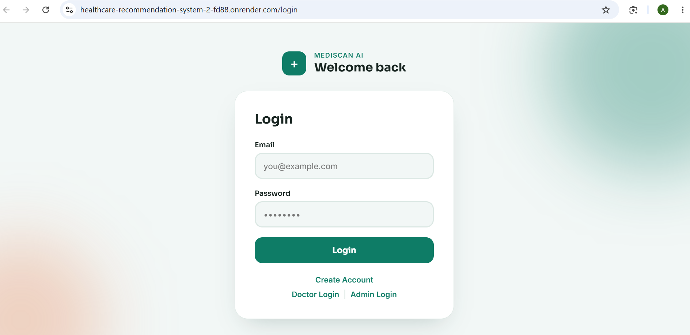
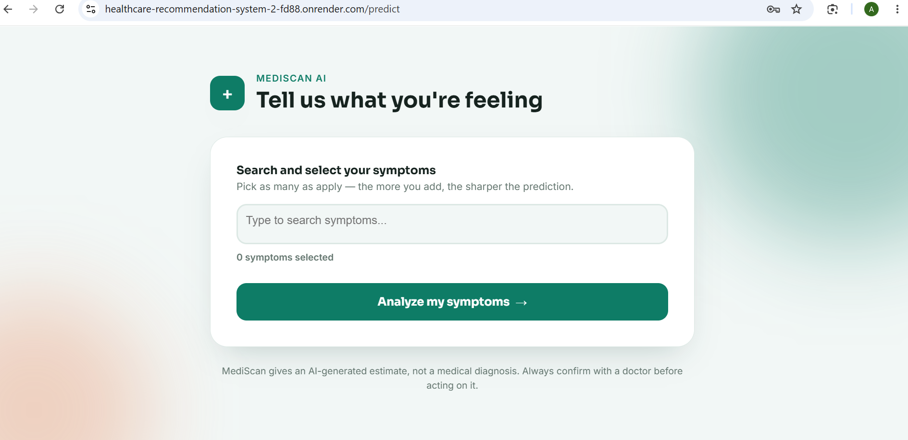
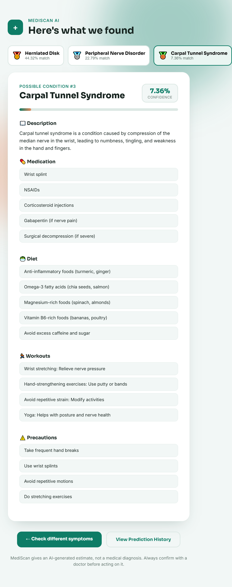
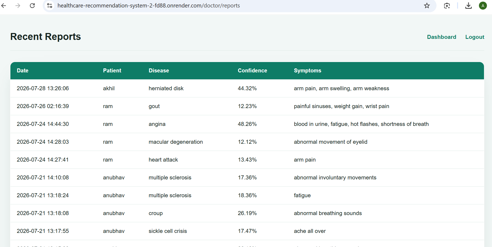
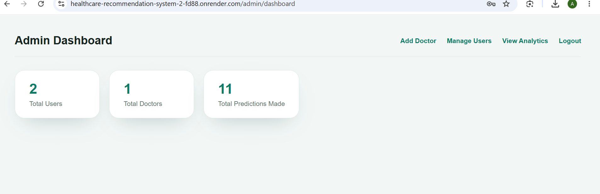

# 🏥 Healthcare Recommendation System

A Flask-based Healthcare Recommendation System that predicts diseases using Machine Learning based on user-selected symptoms and provides personalized healthcare recommendations.

## 🚀 Live Demo

https://healthcare-recommendation-system-2-fd88.onrender.com

---

## ✨ Features

### User
- Register & Login
- Predict Disease
- View Prediction History
- Download Reports

### Doctor
- Doctor Login
- Dashboard
- Search Patients
- View Patient History
- View Reports

### Admin
- Admin Login
- Dashboard
- Add Doctor
- Manage Users
- Remove Doctors
- View Analytics

---

## 🧠 Machine Learning

- Logistic Regression (Final Model)
- Compared with:
  - Decision Tree
  - Random Forest
  - XGBoost

---

## 🛠 Tech Stack

- Python
- Flask
- Flask-Login
- Flask-Bcrypt
- Flask-SQLAlchemy
- SQLite
- Scikit-learn
- Pandas
- NumPy
- HTML
- CSS
- Bootstrap
- Render

---

## 📂 Project Structure

```text
Healthcare-Recommendation-System
│
├── app.py
├── config.py
├── requirements.txt
├── Procfile
├── database/
├── models/
├── routes/
├── services/
├── templates/
├── static/
├── datasets/
└── docs/
```

---

## ⚙️ Installation

```bash
git clone https://github.com/pareek-anubhav/Healthcare-Recommendation-System.git
cd Healthcare-Recommendation-System

pip install -r requirements.txt

python app.py
```

---

## 🔐 Authentication

- User Login
- Doctor Login
- Admin Login
- Role-Based Access Control
- Password Hashing using Flask-Bcrypt

---

## 👨‍💻 Author

**Anubhav Pareek**

GitHub: https://github.com/pareek-anubhav
## 📸 Screenshots

### Login


### Prediction


### Result


### Doctor Dashboard


### Admin Dashboard
